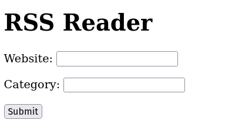

# news

This is course work from Python Web Service From Idea to Production.

[https://terokarvinen.com/2021/python-web-service-from-idea-to-production-2022/](https://terokarvinen.com/2021/python-web-service-from-idea-to-production-2022/)

You can pull rss feeds from your favourite finnish newssites (Iltalehti, Iltasanomat, Helsingin Sanomat). You can decide the category of the news. Project is in alpha stage.

Link to a production server can be found [here](http://jyrilampio.me/rss/)
## Features

The course work has CRUD, Login, Logout and register functions.

## Bugs

All the users can still delete each other's entries. RSS reader works only with specific sites.

## Installation

- sudo apt-get install virtualenv git
- virtualenv env/ -p python3 --system-site-packages
- git clone git@github.com:JyriLampio/news.git
- source env/bin/active
- cd news/
- pip install -r requirements.txt
- ./manage.py migrate
- ./manage.py createsuperuser
- ./manage.py runserver

## Screenshots

